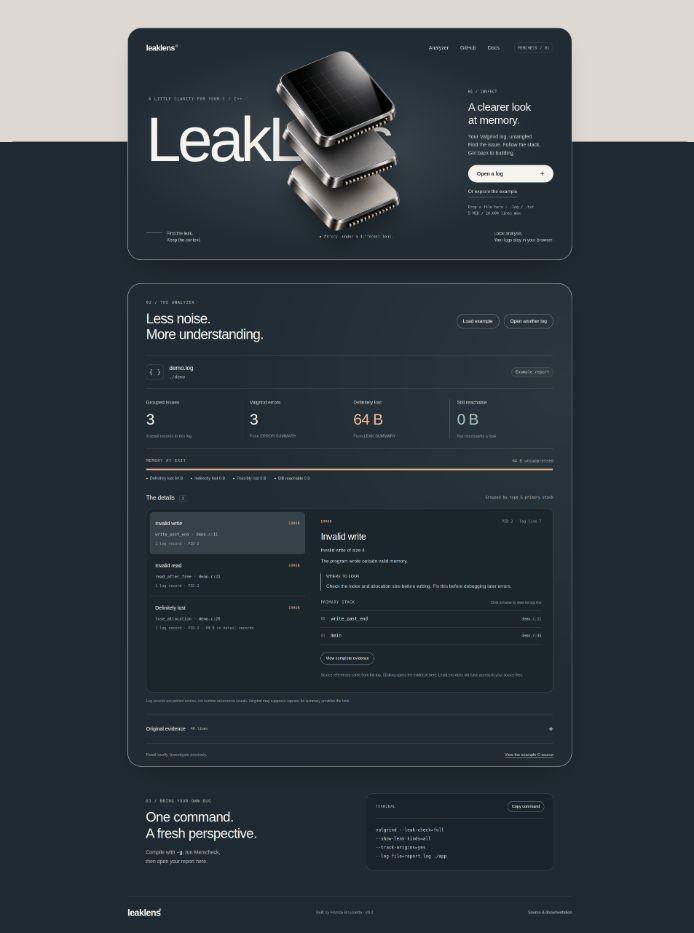

# LeakLens

A local-first visual reader for Valgrind Memcheck text logs. Open a log, inspect grouped memory reports, and click stack frames to find the corresponding lines in the original evidence.

**[Try the live demo](https://leaklens-seven.vercel.app)**



## What it does

- Reads `.log` and `.txt` files entirely in the browser; file contents are not sent to a server.
- Groups repeated detail records by process, issue type, access size, and complete primary stack. Memory addresses do not affect the grouping.
- Separates Valgrind's error count from the number of printed detail records.
- Shows known leak-summary totals and marks missing values as unknown.
- Explains invalid reads/writes, uninitialized values, invalid/mismatched frees, overlapping buffers, suspicious allocations, system-call parameters, and the four main leak categories.
- Preserves allocation/free/origin evidence in the original log without mixing it into the primary stack.
- Includes a real Memcheck log from a deliberately buggy C program.

## Run locally

Python 3 is sufficient; there are no application dependencies to install.

```sh
python3 -m http.server 4173 --directory dist --bind 127.0.0.1
```

Open <http://127.0.0.1:4173>. A clearly marked example report loads automatically; choose **Or explore the example** to jump to it, or open a log of your own. ES modules require an HTTP server; opening `index.html` directly from the filesystem will not work reliably.

## Generate a log

Compile your program with debug symbols and run Memcheck:

```sh
gcc -g -O0 -o app app.c
valgrind --leak-check=full --show-leak-kinds=all --track-origins=yes --log-file=report.log ./app
```

To reproduce the included teaching example:

```sh
cd dist/examples
gcc -g -O0 -fno-omit-frame-pointer -o demo demo.c
valgrind --leak-check=full --show-leak-kinds=all --track-origins=yes --log-file=demo.log ./demo
```

The C example intentionally has undefined behavior. It writes past a heap allocation, reads freed memory, and loses a 64-byte allocation. It was checked with GCC and Valgrind 3.22.0 on Linux. Addresses and process IDs vary between runs. The checked-in log is real; only machine-specific executable and Valgrind library paths have been shortened for readability.

Valgrind must be available to generate new logs. Reading existing logs does not require Valgrind. See the [official Memcheck manual](https://valgrind.org/docs/manual/mc-manual.html) for interpretation and options.

## Test

Node.js is required only for the parser tests:

```sh
npm test
```

Alternatively run `node --test tests/parser.test.js`. Tests cover repeat grouping, different callers, allocation/origin stacks, multiple processes, incomplete logs, clean runs, leak categories, numeric separators, unsupported inputs, source columns, size limits, and the real demo fixture.

## Structure

```text
dist/
  index.html             Accessible application shell
  styles.css             Responsive workspace layout
  assets/                Original decorative memory-chip artwork
  js/parser.js           Pure parsing and grouping logic
  js/app.js              File reading, state, rendering, and interactions
  examples/demo.c        Deliberately buggy program
  examples/demo.log      Real Memcheck output
tests/parser.test.js     Parser tests with Node's built-in runner
docs/WALKTHROUGH.md      Guided explanation and a first learning exercise
```

`dist` is the actual application source and can be served on any static host. There is no generated build step. No source credentials are stored in this repository.

## Deploy on Vercel

Import this GitHub repository, select **Other** as the framework, and use `dist` as the root directory. No build or install command is required. The repository root contains the tests and documentation; only `dist` is served to visitors. Pushes to `main` update the production site through Vercel's Git integration.

## Scope and limitations

- English plain-text Memcheck logs with standard `==PID==` or `--PID--` prefixes. XML and other Valgrind tools are outside v0.1.
- Maximum file size: 5 MiB and 20,000 lines.
- Stack clicks reveal log evidence, not files on your computer. Source upload and editor integration are not included.
- Printed records are not runtime occurrences. Memcheck can suppress repeated errors; the app uses `ERROR SUMMARY` for the total and does not interpret detailed `-s` repetition counts.
- Memory totals come from `LEAK SUMMARY`. Detail records can include indirect bytes or overlap; adding them would give misleading totals.
- Multiple processes are kept separate. Concatenated runs that reuse a PID generate a warning and unknown aggregate totals; use a separate file for each run.
- Unsupported error families may only appear in the original log. A missing or zero supported-issue list does not prove a program is correct.
- No log history is persisted. Refreshing the page clears the current report.

## Privacy and implementation

Files are read through the browser File API. Parsing and rendering run locally. The example is a static asset fetched from the host. User-provided strings are rendered with `textContent`; no log contents are interpreted as HTML. Optional browser WebMCP tools expose the same local analysis action and concise report read-back when supported.

## License

MIT. Built as a small developer tool with a testable parser and explicit uncertainty handling. See [the design notes](docs/DESIGN.md) for the visual direction and generated artwork provenance.
